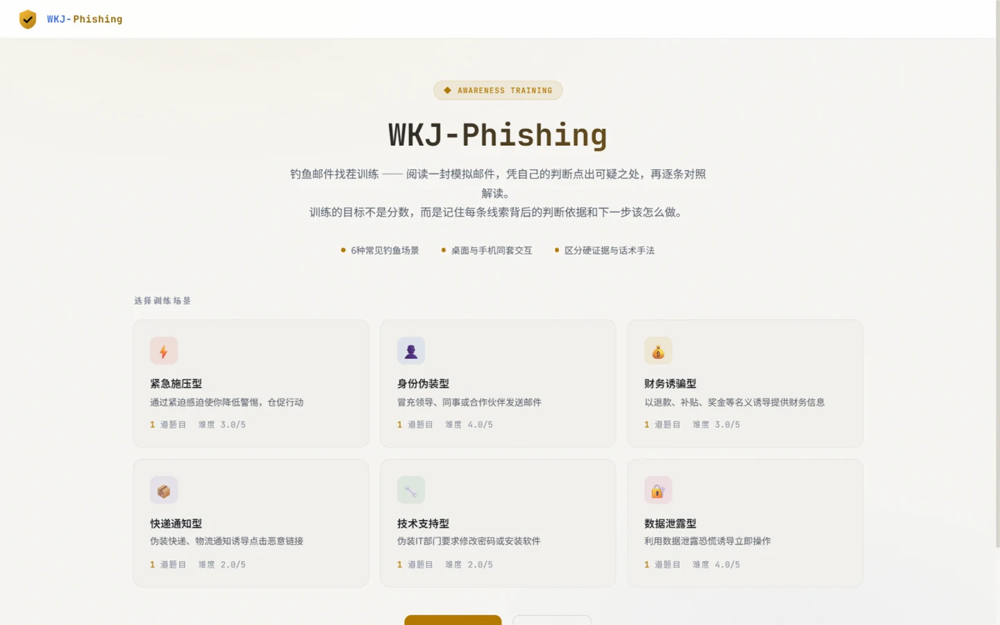
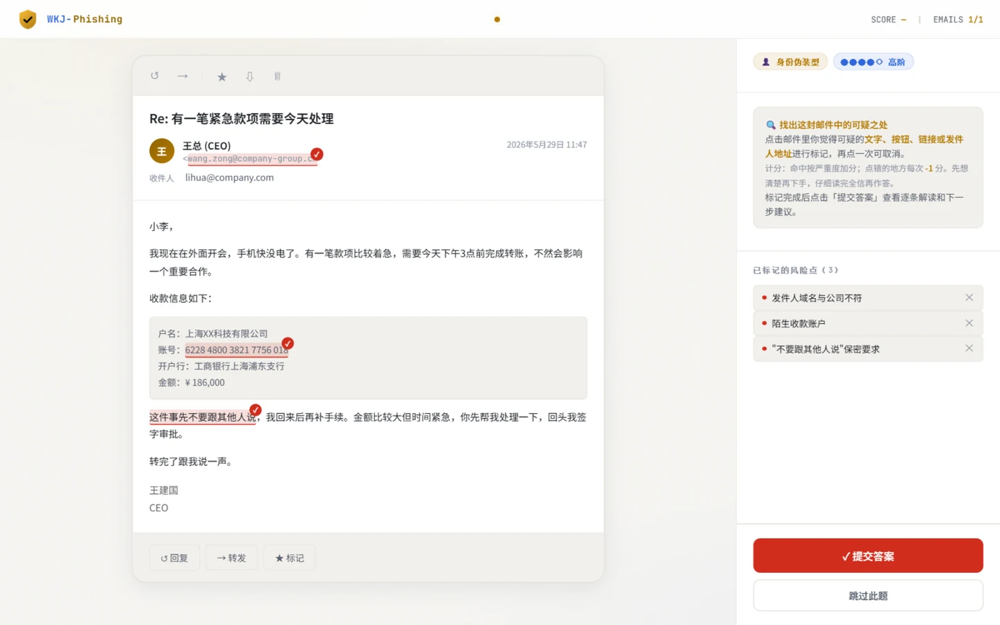
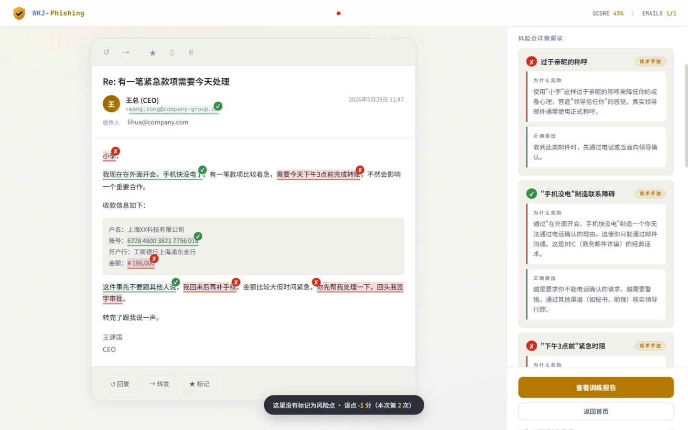
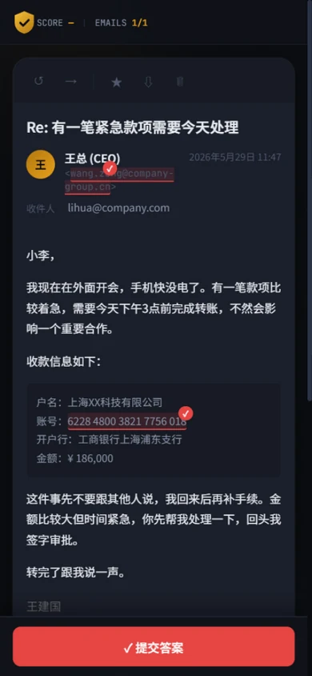

# WKJ-Phishing

> 钓鱼邮件找茬训练 · Interactive Phishing Email Awareness Training

**简体中文** | [English](README.en.md)

[](LICENSE)

这是一个纯静态的单页训练工具：读一封模拟邮件，凭自己的判断点出可疑之处，提交后逐条对照解读——看到什么线索、为什么需要警惕、下一步应该怎样核实或处理。它不模拟真实攻击，也不收集任何数据，只做一件事：把"识别钓鱼邮件"从一句口号拆成一条条可以练习的判断。

## 在线体验

**[https://keji-wang.github.io/phishing-email-trainer/](https://keji-wang.github.io/phishing-email-trainer/)**

无需登录、无后台、无跟踪，所有内容随页面一次性加载。

## 界面

| 桌面 · 首页 | 桌面 · 标记风险点 |
|---|---|
|  |  |

| 桌面 · 结果解读 | 手机 · 训练 |
|---|---|
|  |  |

## 训练流程

1. **选题**：按场景选择单封邮件，或"开始全部训练"（按难度从易到难排列）。
2. **标记**：点击邮件里任何你觉得可疑的文字、按钮、链接或发件人地址；再点一次取消。
3. **提交**：系统不提示"点没点对"，提交后才统一揭示。
4. **解读**：每个风险点都有"为什么危险 + 正确做法"，并区分两类信号：
   - **硬证据**（蓝色标签）：可以直接核实的客观事实，如仿冒域名、陌生收款账号、索要验证码；
   - **话术手法**（橙色标签）：心理操控信号，如紧迫时限、保密要求、权威包装。
5. **下一步怎么做**：每封邮件给出 2-3 条处置建议（核实渠道、上报路径）。
6. **重练**：可随时重新开始；单封邮件可跳过。

## 计分规则

设计目标是鼓励"仔细读完再精准下手"，而不是鼓励到处点击：

- 命中风险点按严重度加权加分（低 +1 / 中 +2 / 高 +3 / 严重 +4）；
- 点击非风险区域每次 **-1 分**（单题最低 0 分），规则在答题前明示；
- 漏选不倒扣，但会逐条揭示；
- "跳过此题"按同一权重口径计入满分，保证总得分率可比。

## 本地运行

```bash
git clone https://github.com/Keji-Wang/phishing-email-trainer.git
cd phishing-email-trainer

# 任意静态服务器即可
python -m http.server 8000
# 或
npx serve .

# 浏览器访问 http://localhost:8000
```

直接双击 `index.html` 也能运行（无任何外部接口依赖）。

## 部署

推送到 `main` 分支后由 GitHub Pages 自动发布（仓库 Settings → Pages → Deploy from branch）。也可以用任意静态托管或：

```bash
docker run -d -p 80:80 -v $(pwd):/usr/share/nginx/html:ro nginx:alpine
```

## 题目维护

全部题目在 `index.html` 的 `EMAILS` 数组中，一封邮件一个对象：

```javascript
{
  id: 'e001',
  scenario: 'urgency',          // 场景 key，对应 SCENARIOS 中的定义
  difficulty: 3,                // 难度 1-5，"开始全部训练"按它排序
  title: '紧急密码重置通知',      // 题目名
  fromRiskId: 'e001-rX',        // 可选：把发件人地址设为可点击风险点
  email: {
    subject: '...',
    from: { name: '显示名', email: 'sender@example.net' },
    to: 'victim@example.com',
    date: '2026年5月28日 16:32',
    body: `<p>正文 HTML。<span class="risk-point" data-risk-id="e001-r1">可疑文字</span></p>`,
    attachments: []             // 可选：[{ name: 'xx.pdf', size: '245KB' }]
  },
  riskPoints: [
    {
      id: 'e001-r1',            // 与 data-risk-id 对应
      type: 'evidence',         // 'evidence' 硬证据 | 'tactic' 话术手法
      label: '风险点标签',
      severity: 'high',         // low | medium | high | critical（影响分值）
      explanation: '为什么危险',
      correctAction: '正确做法'
    }
  ],
  nextSteps: ['处置建议一', '处置建议二']   // 可选：结果页"下一步怎么做"
}
```

要点：

- 正文中的可点击风险点用 `<span class="risk-point" data-risk-id="...">文字</span>` 标注，按钮则加在 `<a class="email-cta risk-point">` 上；
- 每封邮件的 `riskPoints` 里每个 `id` 都必须在正文中有一个对应的 `data-risk-id`，否则该点无法被选中；
- 新增场景需同步在 `SCENARIOS` 中补充名称、图标与描述。

## 设计取舍

- **不设 hover 提示**：悬停出现下划线等于把答案标了出来，训练会退化成"扫雷全选"。本工具在桌面和手机上使用完全相同的"点击标记"交互，先想后点。
- **误点轻惩罚而非零成本**：完全无反馈会让用户不知道点到没有；重惩罚会吓退探索。-1 分 + 即时轻提示，既给出反馈又让"碰运气"无利可图。
- **区分证据与话术**：把"域名仿冒"这类可核实证据和"制造紧迫感"这类心理信号分开标注，避免把单一表象直接判为恶意。
- **不做后台/登录/AI/统计**：这是一个可以直接发给学员的练习页面，不引入账号体系、数据收集或需要维护的服务端。所有内容单文件内置。

## 当前局限

- 题库（6 封邮件、48 个风险点）内置在 `index.html` 中，扩充题量后如需多人维护，建议再拆分数据文件；
- 不保存练习进度或历史成绩（刷新即重置），这是有意的隐私取舍；
- 界面语言目前只有中文。

## 许可证

[MIT](LICENSE) © Jeffrey Wang

---

⚠️ **免责声明**：本工具仅用于网络安全教育与培训。邮件内容均为虚构，请勿用于任何非法活动。
